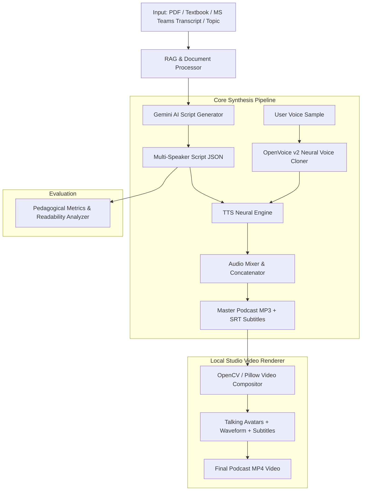

# 🎙️ Podcast AI: Multi-Speaker Educational Synthesis with Voice Cloning

<div align="center">

[](https://python.org)
[](https://fastapi.tiangolo.com)
[](https://github.com/rany2/edge-tts)
[](https://github.com/myshell-ai/OpenVoice)
[](https://ai.google.dev)
[](LICENSE)

**An intelligent end-to-end multi-speaker AI podcast and educational synthesis platform.**  
*Transform dry PDFs, textbooks, and MS Teams / Zoom meeting transcripts into engaging, multi-speaker conversational podcast audio, synchronized subtitles, and animated studio videos with personalized neural voice cloning.*

[Features](#-key-features) • [Architecture](#-system-architecture) • [Quickstart](#-quickstart-guide) • [API Reference](#-api-endpoints) • [Tech Stack](#-technology-stack)

</div>

---

## 🌟 Key Features

### 1. 👥 Multi-Speaker Conversational Podcast Synthesis
- Converts raw educational topics or unstructured text into high-quality, engaging dual-host or multi-guest dialogue.
- Dynamic script generation powered by **Gemini 2.5 / LLMs** with conversational humor, pedagogical analogies, and natural turn-taking.
- Multi-accent neural speech synthesis supporting Indian English, US English, British English, and diverse global voices.

### 2. 📝 Universal MS Teams & Zoom Transcript Parser
- Ingests transcripts from **Microsoft Teams, Zoom, Google Meet, PDF lecture notes, VTT, and SRT**.
- Automatic header, timestamp, and metadata cleaner.
- Preserves genuine multi-speaker turns (e.g. Professor, Students, Support Staff) and re-synthesizes the entire lecture into a studio-grade master audio & video.

### 3. 🧬 Neural Voice Cloning (OpenVoice v2)
- Upload or record a short **10-second reference audio sample**.
- Uses Tone Color Converter embeddings to clone the user's authentic voice and inject it into the podcast dialogue turns dynamically.

### 4. 📚 Textbook Chapter-wise Studio & Live Q&A
- Upload any academic textbook or curriculum PDF.
- Intelligent chapter extractor splits the book into structured modules.
- Generates chapter-by-chapter conversational audio lessons.
- **Interactive Live Doubt Solver:** Ask questions about any chapter and receive spoken, context-aware answers from the AI Professor.

### 5. 🎬 Automated Local Video Studio Renderer
- Produces MP4 videos with animated speaker avatars that react when speaking.
- Generates real-time **audio visualizer waveforms** and synchronized **karaoke subtitles (SRT)**.
- Runs 100% locally with OpenCV & Pillow — no expensive external cloud rendering APIs required.

### 6. 📊 Academic & Pedagogical Evaluation Metrics
- Evaluates script quality with:
  - **Flesch Reading Ease & Flesch-Kincaid Grade Level**
  - **Lexical Diversity (Type-Token Ratio / TTR)**
  - **Speaker Talk-Time Balance & Turn Distribution**
  - **Conversational Quality Grade Rating**

---

## 🏗️ System Architecture



---

## 📁 Project Structure

```
d:/AI PodCast/
├── app.py                      # FastAPI Web Application & API Server
├── requirements.txt            # Python Dependencies
├── core/
│   ├── rag_processor.py        # PDF extraction & MS Teams / Zoom transcript parser
│   ├── script_generator.py     # Gemini AI dialogue generation & Q&A engine
│   ├── tts_engine.py           # Neural multi-speaker speech synthesis
│   ├── audio_mixer.py          # Audio concatenation, normalization & SRT generator
│   ├── voice_clone_engine.py   # OpenVoice v2 tone color converter & embedding cache
│   ├── local_video_renderer.py # OpenCV video renderer with avatar animations
│   └── evaluation_metrics.py   # Flesch-Kincaid, TTR lexical diversity & balance analysis
├── web/
│   ├── templates/
│   │   └── index.html          # Modern Glassmorphic Web Dashboard
│   └── static/
│       ├── css/                # Studio styling & animations
│       ├── js/                 # Web audio visualizers, recorder & frontend logic
│       ├── avatars/            # Animated host & guest avatar assets
│       └── voice_clone/        # User reference voice storage
└── outputs/                    # Output MP3 audio, MP4 videos, and SRT captions
```

---

## 🚀 Quickstart Guide

### Prerequisites
- **Python 3.10+** installed
- **FFmpeg** installed and added to system `PATH`

### 1. Clone the Repository
```bash
git clone https://github.com/monikaks-234/Podcast-AI-Multi-Speaker-Educational-Synthesis-with-Voice-Cloning.git
cd Podcast-AI-Multi-Speaker-Educational-Synthesis-with-Voice-Cloning
```

### 2. Create and Activate Virtual Environment
```bash
# Windows
python -m venv venv
venv\Scripts\activate

# Linux / macOS
python3 -m venv venv
source venv/bin/activate
```

### 3. Install Dependencies
```bash
pip install -r requirements.txt
```

### 4. Configure API Keys
Create a `.env` file or export your Google Gemini API Key:
```bash
# Windows (PowerShell)
$env:GEMINI_API_KEY="your-gemini-api-key"

# Linux / macOS
export GEMINI_API_KEY="your-gemini-api-key"
```

### 5. Launch the Studio
```bash
python app.py
```
Open your browser and navigate to: **`http://127.0.0.1:8000`** 🎉

---

## 📡 API Endpoints

| Endpoint | Method | Description |
|---|---|---|
| `/` | `GET` | Main interactive Podcast Studio web dashboard |
| `/api/generate-podcast` | `POST` | Generate full multi-speaker podcast from topic or transcript PDF |
| `/api/pdf-chapters/extract` | `POST` | Extract structured chapters from course textbook PDF |
| `/api/pdf-chapters/generate-chapter-audio` | `POST` | Generate interactive dialogue audio for a specific chapter |
| `/api/pdf-chapters/ask-question` | `POST` | Live voice doubt solver answering student questions |
| `/api/voice-clone/upload` | `POST` | Upload audio sample to clone user's voice |
| `/api/voice-clone/status` | `GET` | Check active voice clone profile status |
| `/api/voice-clone/delete` | `POST` | Reset voice clone back to default AI voices |
| `/api/history` | `GET` | Fetch past generated podcasts, transcripts, and metrics |
| `/api/history/{id}` | `DELETE` | Delete a specific generation entry and its files |

---

## 🛠️ Technology Stack

- **Backend Framework:** FastAPI, Uvicorn, Jinja2
- **Language Models:** Google Gemini AI API
- **Speech Synthesis (TTS):** Edge-TTS (Neural Microsoft Speech Engine)
- **Voice Cloning:** OpenVoice v2 ToneColorConverter
- **Document Processing:** PyPDF, Regex Tokenizer, Multi-Format Transcript Parser
- **Audio Engineering:** Pydub, SciPy, Wave
- **Video & Graphics Rendering:** OpenCV (cv2), Pillow (PIL), NumPy
- **Frontend:** Responsive Vanilla JS, Modern CSS Glassmorphism, Web Audio API

---

## 📄 License

This project is licensed under the **MIT License** - see the [LICENSE](LICENSE) file for details.

---

<div align="center">
Developed with ❤️ by <a href="https://github.com/monikaks-234">Monika K S</a>
</div>